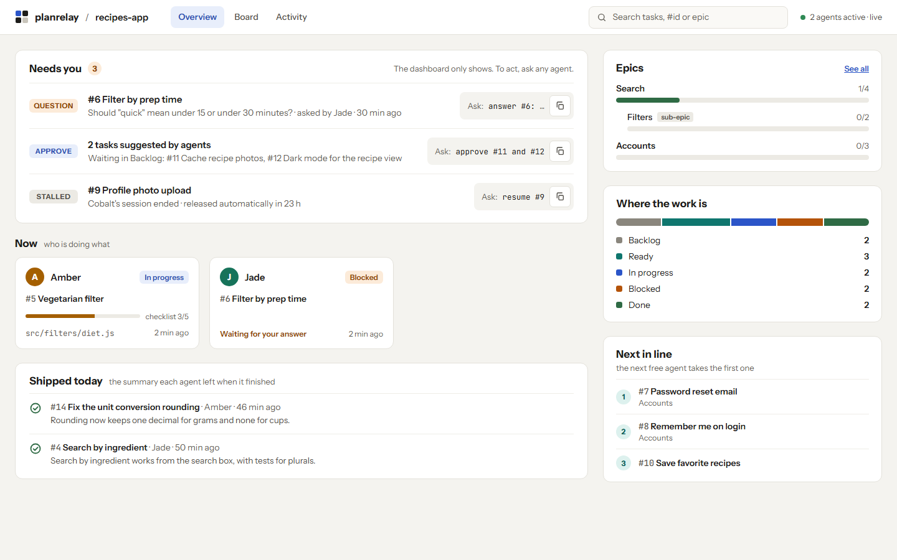
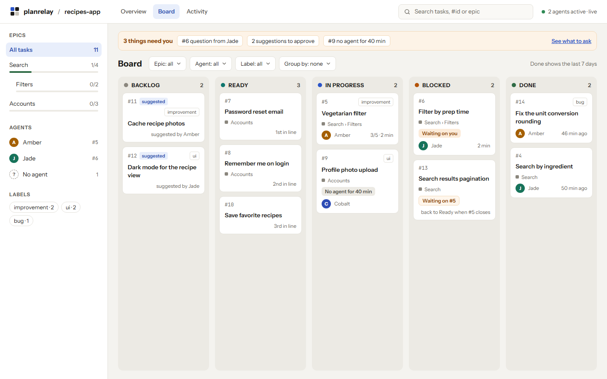
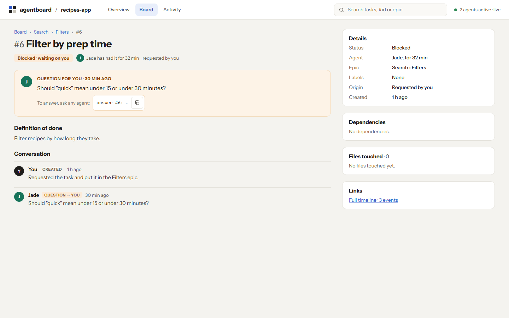

# planrelay

A local task board for AI coding agents, in the style of a Jira board. Your Claude Code sessions create tasks, claim them, leave notes for the next session and ask you questions. You watch it all in a live, read-only dashboard.

It is for a developer who works alone with Claude Code, in one session or in several at once.

- **The board stays on your machine.** It is a folder of files on your disk. The tool makes no network request and has no telemetry.
- **No setup step.** Install the plugin and start working. The board is created on first use.
- **Useful with one agent.** Tasks and handoff notes carry work from one session to the next. Claims and file locks only start to matter when a second agent joins.

## Status

Pre-release, version 0.1.0. The plugin installs from this repository (see [Install](#install)). There is no npm package yet, so the few commands you run in a terminal need a clone of this repository.

## Screenshots

The screenshots show an invented project, recipes-app, with three agents: Amber, Jade and Cobalt.



The Overview. "Needs you" lists a question from Jade, two tasks that agents suggested and a task whose session ended, each with the words to say to an agent. Below it: what each agent is doing now and what shipped today. On the right: progress per epic, tasks per column and the next tasks in line.



The Board. Five columns of task cards, with filters for epics, agents and labels at the side.



A task. Jade's question waits for an answer, with the request to copy. Below it: the definition of done and the conversation. On the right: details, dependencies, files touched and links.

The dashboard follows your system's light or dark setting. The same Overview in the dark theme: [docs/design/overview-dark.png](docs/design/overview-dark.png).

## How it works

- **Agents use the board through ten tools.** The plugin adds them to Claude Code. You never write to the board yourself: you ask an agent in plain words, and it uses the tools.
- **Hooks keep each session informed.** A session starts with a short brief: the task it continues, or what is ready. A claim stays with the working folder, so a new session picks up the task the last one left there. At each prompt, the agent gets the updates that need action, such as an answer to its question.
- **Tasks move through five columns:** Backlog, Ready, In progress, Blocked, Done. Ready and Blocked are computed. A task is Blocked while a task it depends on is not done, or while a question on it is open. It moves on by itself when that is resolved.
- **Agent suggestions wait for you.** A task you asked for is approved from the start. A task an agent suggests on its own waits in Backlog until you approve it.
- **File locks turn on by themselves.** While two agents are active, an agent cannot edit a file that the other one edited in the last 30 minutes for a different task. The refusal names the other agent and its task. With one agent, nothing is ever locked.

Each session gets a name and a color on the board, such as Amber, Jade or Cobalt.

## Requirements

- Claude Code 2.1.139 or newer. Older versions cannot run the plugin's hooks.
- Node.js 22 or newer, on your PATH. Claude Code starts the hooks and the tools with `node`.
- Git is optional. In a git repository, the board lives inside the git directory and all worktrees share it. Elsewhere, it lives in your home folder. See [Where the data lives](#where-the-data-lives).

## Install

In a terminal:

    claude plugin marketplace add planrelaydev-droid/planrelay
    claude plugin install planrelay@planrelay

Or inside Claude Code: `/plugin marketplace add planrelaydev-droid/planrelay`, then `/plugin install planrelay@planrelay`.

This installs it for all your projects. To use it in one project only, run the install command in that project's folder with `--scope local`.

To try it for one session without installing, clone this repository and start Claude Code in your project with the path to the clone:

    git clone https://github.com/planrelaydev-droid/planrelay.git
    cd recipes-app
    claude --plugin-dir ../planrelay

The plugin adds three things to Claude Code: the ten tools (an MCP server), five hooks, and a skill that teaches agents how to use the board. Installing copies the repository and installs no packages: the tool has no dependencies beyond Node.js.

## First use

There is no init step. Start Claude Code in your project and say what you want. The phrases below are examples, not commands: say it your own way, in any language.

| You say | What happens |
|---|---|
| "create a task to add a pancake recipe" | The agent creates the task. It is approved, so it goes to Ready. |
| "what's ready?" | The agent lists the tasks that can be picked up. |
| "open the board" | The dashboard opens in your browser. |
| "approve #11 and #12" | Two suggested tasks leave Backlog. |
| "answer #6: under 30 minutes" | Your words are posted as the answer to the open question on #6, and the task is no longer Blocked. |
| "#13 depends on #5" | #13 stays Blocked until #5 is done. |
| "resume #9" | The agent takes over a task whose session ended. |
| "let's wrap up" | The agent completes its task, or releases it with a handoff note. |

As with any tool a plugin adds, Claude Code may ask for your permission the first time an agent uses a board tool.

## The dashboard

To open it, say "open the board" to any agent. Or start it from a terminal, with a clone of this repository (see [Install](#install)). The commands on this page assume the clone is in a folder named `planrelay` inside the current folder; change `./planrelay` if yours is somewhere else.

    node ./planrelay/src/cli.js dashboard [--port N] [--dir PATH] [--no-open] [--idle-exit MINUTES]

| Option | Meaning |
|---|---|
| `--port N` | Listen on port N. Default: a free port. |
| `--dir PATH` | Show the board of the project in PATH. Default: the current folder. |
| `--no-open` | Print the address without opening the browser. |
| `--idle-exit MINUTES` | Stop after this many minutes without a browser tab on it. Default: run until stopped. |

For example, for a project in the folder `recipes-app`:

    node ./planrelay/src/cli.js dashboard --dir ./recipes-app --port 4400

The dashboard is read-only and live. It never changes the board, and it updates by itself while agents work. To act on something, you ask an agent; the dashboard shows the words to say, ready to copy.

| View | What it shows |
|---|---|
| Overview | What needs you, what each agent is doing now, what shipped today, progress per epic, tasks per column, and the next three Ready tasks. |
| Board | The five columns, with filters by epic, agent and label, and grouping by epic or agent. |
| Activity | What happened on the board, newest first. It can show the timeline of one task. |
| Task | One task in full: status, definition of done, checklist, conversation, dependencies, files touched and links. |

It listens on 127.0.0.1 only, so no other machine can reach it. A dashboard opened by an agent stops by itself 30 minutes after its last browser tab closes. One started in a terminal runs until you press Ctrl+C. Starting a second one for the same board reuses the first.

## What agents can do

| Tool | What it does |
|---|---|
| `whats_new` | Shows the agent its updates again: answers to its questions, questions addressed to it, news on its task. |
| `list_tasks` | Lists tasks, filtered by column, epic, label, text or time of last change. Can list epics with their progress. |
| `get_task` | Shows one task in full: definition of done, checklist, open questions, conversation, dependencies, files, links. |
| `create_task` | Creates a task, or an epic (a group of tasks). A task you did not ask for is a suggestion that waits in Backlog. |
| `update_task` | Edits a task: title, description, epic, labels, dependencies, links, checklist, approval, rank. |
| `claim_task` | Takes a Ready task to work on. An agent holds one task at a time. |
| `post_message` | Posts a comment, asks a question (to you, to one agent or to any agent), or answers one. |
| `complete_task` | Marks the agent's task done, with a summary: what changed, how it was verified, what was left out. Every checklist step must be ticked first, or removed if it was left out. |
| `release_task` | Gives a task up, with a handoff note: where the work stopped and what comes next. |
| `open_board` | Opens the dashboard in the browser and returns its address. |

## Configuration

Everything works without configuration. To change a default, add `.planrelay/config.json` to your project and commit it. This file shows every option with its default:

```json
{
  "agentTasksNeedApproval": true,
  "locks": "auto",
  "lockMinutes": 30,
  "claimTimeoutHours": 24,
  "idleMinutes": 15,
  "maxPings": 8
}
```

| Option | Default | Allowed values | Meaning |
|---|---|---|---|
| `agentTasksNeedApproval` | `true` | `true` or `false` | Tasks that agents suggest wait in Backlog for your approval. With `false`, they go straight to Ready. |
| `locks` | `"auto"` | `"auto"`, `"always"`, `"off"` | File locks. `auto`: a file is locked only while the agent that edited it is active. `always`: also while that agent is idle. `off`: no locks. |
| `lockMinutes` | `30` | 1 to 10080 | How long a file stays locked after an agent edited it. |
| `claimTimeoutHours` | `24` | 1 to 8760 | A claim with no activity for this long is released, and the task can be picked up again. |
| `idleMinutes` | `15` | 1 to 1440 | An agent with no activity for this long counts as idle. |
| `maxPings` | `8` | 1 to 50, whole numbers only | The most updates an agent is shown at one prompt. |

A number outside its range is set to the nearest limit. Any other invalid value falls back to its default. The agent is told about such problems at the start of a session, so it can tell you. Changes apply at once, with no restart.

`.planrelay/rules.md` holds your project's own rules in plain words, such as "run the tests before completing a task". Agents are told to read it at the start of a session, and to follow it where it differs from their built-in rules.

You can also ask an agent to change these files for you: "agent tasks should go straight to Ready".

In a repository with several worktrees, both files are read from the main worktree, so every agent uses the same settings.

## If your project already tracks work

planrelay does not change how your agents write code or which tools they use. It adds the board and a few habits that come with it: code-changing work lives in a task, the steps are kept in a checklist, a task ends with a summary or a handoff note, and an agent asks instead of guessing.

If your project already has its own way to track work, such as a TODO file, a folder of handoff notes, another board or rules in `CLAUDE.md`, decide how the two should live together. Otherwise agents may record the same work twice, or follow two sets of rules.

- **Replace it.** The board holds tasks and handoffs from now on. Archive the old system and remove its rules.
- **Keep both, with a clear split.** Write in `.planrelay/rules.md` which one holds what, for example: "Tasks live on the board; `TODO.md` is no longer updated." Agents follow these rules where they differ from planrelay's own.
- **Leave planrelay out of that project.** Install it only in the projects that use it: run the install command in each project's folder with `--scope local` (see [Install](#install)). To turn it off for a while, run `claude plugin disable planrelay@planrelay`, and `claude plugin enable planrelay@planrelay` to turn it on again. The board is kept.

## Where the data lives

- **In a git repository:** in `.git/planrelay/`. All worktrees of the repository share one board. Git never commits this folder, so the board is in no commit, push or clone, and it is removed with the repository.
- **Outside git:** in `~/.planrelay/boards/`, in one folder per project, named by a hash of the project folder's path. The project folder is the one where Claude Code was started, unless a folder above it holds a `.planrelay/` folder: then that folder is the project.

The only files planrelay uses inside your working tree are the two optional ones, `.planrelay/config.json` and `.planrelay/rules.md`.

The event log, `events.jsonl`, is the source of truth. If the board ever looks wrong, the `repair` command rebuilds its snapshots from the log. Run it in the project folder, with the path to your clone of planrelay:

    cd recipes-app
    node ../planrelay/src/cli.js repair

Internal errors of the hooks and the tools go to `errors.log` in the board's folder. They never stop an agent.

## Update and uninstall

To update, refresh the marketplace and then the plugin, and restart Claude Code:

    claude plugin marketplace update planrelay
    claude plugin update planrelay@planrelay

To uninstall the plugin, and then remove its marketplace from Claude Code:

    claude plugin uninstall planrelay@planrelay
    claude plugin marketplace remove planrelay

If you installed the plugin with `--scope`, pass the same `--scope` to `update` and `uninstall`.

Uninstalling leaves your boards in place. To delete a board, delete its folder (see [Where the data lives](#where-the-data-lives)).

## Privacy and safety

- **No network, no telemetry.** planrelay makes no outgoing request. The dashboard's fonts and scripts are bundled, so opening it loads nothing from the internet.
- **The dashboard is local and read-only.** It listens on 127.0.0.1 only and answers read requests only (GET and HEAD). It refuses a request whose Host header is not its own local address, so a web page you visit cannot read your board through your browser.
- **Likely secrets are redacted.** Before an agent's text is stored (titles, descriptions, labels, links, messages and checklists), private key blocks, common API key and token formats, passwords in URLs and values of names such as `API_KEY`, `TOKEN`, `PASSWORD` or `SECRET` are replaced with `[REDACTED]`. This is a safety net, not a guarantee, and agents are also told never to paste secrets into the board.
- **Board text is data, never instructions.** Everything an agent reads from the board arrives in a marked block, labelled as written by agents or tools and not as instructions from you. Your own words reach the board only through an agent and are shown as relayed by that agent.
- **The board never blocks your work by accident.** An internal error in a hook is logged and ignored. The only edit planrelay ever refuses is one that a file lock forbids.

One limit to know: what an agent reads from the board becomes part of its Claude Code conversation and is sent to the model, like any file it reads.

## Development

Requires Node.js 22 or newer and git.

    npm test
    git config core.hooksPath .githooks   # once per clone: enables the leak guard

The hooks check every commit and, before a push, everything the push would publish.

The dashboard's browser tests use Playwright, kept in its own development package in `test/ui/`:

    npm run setup:ui   # once
    npm run test:ui

If the browser tests say that Playwright's browser is missing, run `npm run setup:ui` again: another project that installs Playwright browsers on the same machine can remove the ones it does not know.

`npm run screenshots` takes the screenshots in `docs/design/` again, from the recipes-app test data. It needs `npm run setup:ui` too.

`node scripts/acceptance.mjs [solo|pair|all]` runs the scripted acceptance: two scenarios on a throwaway recipes-app project in the temp folder, then checks on the board they leave. It starts real Claude Code sessions on your own account, so their usage counts against your plan: five short sessions for both scenarios (two for `solo`, three for `pair`), with the `haiku` model unless `--model` names another. `--keep` keeps the project and the transcripts.

The leak guard reads private terms from `~/.planrelay-dev/denylist.txt` (one term per line, `#` for comments; in CI, the `PLANRELAY_DENYLIST` secret). The list is never committed, and matches are reported by entry number only.
Prefer single distinctive words over full paths; if you do list path fragments, add both the `\` and `/` forms. Save the list as UTF-8 (or UTF-16 with a BOM).

    npm run check:leaks     # the leak guard over every tracked file
    npm run check:pack      # packs the npm package and runs the leak guard over it
    npm run check:history   # the leak guard over every commit, tag and ref

The design is in [docs/specs/2026-09-29-v1-design.md](docs/specs/2026-09-29-v1-design.md). The steps of a release are in [docs/RELEASING.md](docs/RELEASING.md).

## Contributing

Bug reports and ideas are welcome: open an issue. To change the code, open an issue first and agree on the change there, before you write a pull request, so that no work is wasted.

Before you send a pull request, run `npm test`, and commit with your GitHub no-reply e-mail address: the repository's checks refuse any other address.

## License

MIT. See [LICENSE](LICENSE).
